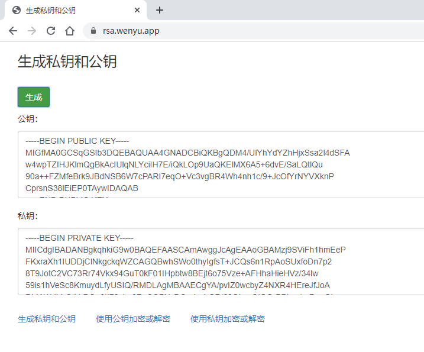
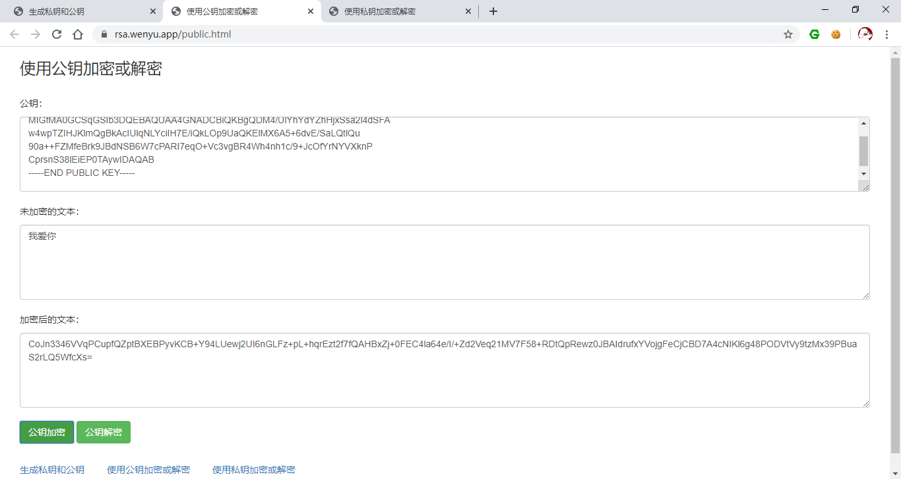
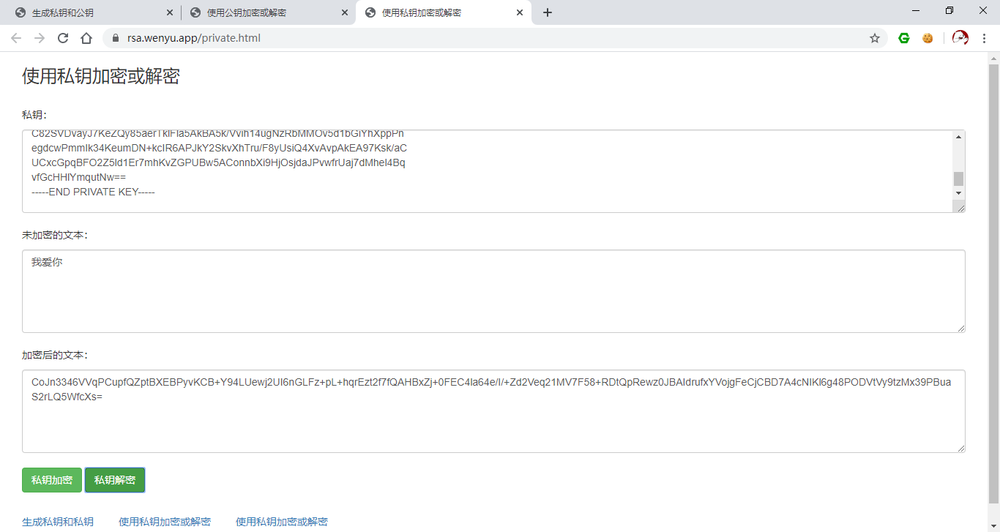

# phpRSA
一个用PHP实现RSA算法的Demo

- generateKey.php 生成私钥和公钥
- private_decrypt.php 私钥解密
- private_encrypt.php 私钥加密
- public_decrypt.php 公钥解密
- public_encrypt.php 公钥加密

生成私钥和公钥：

使用公钥加密或解密：

使用私钥加密或解密：

